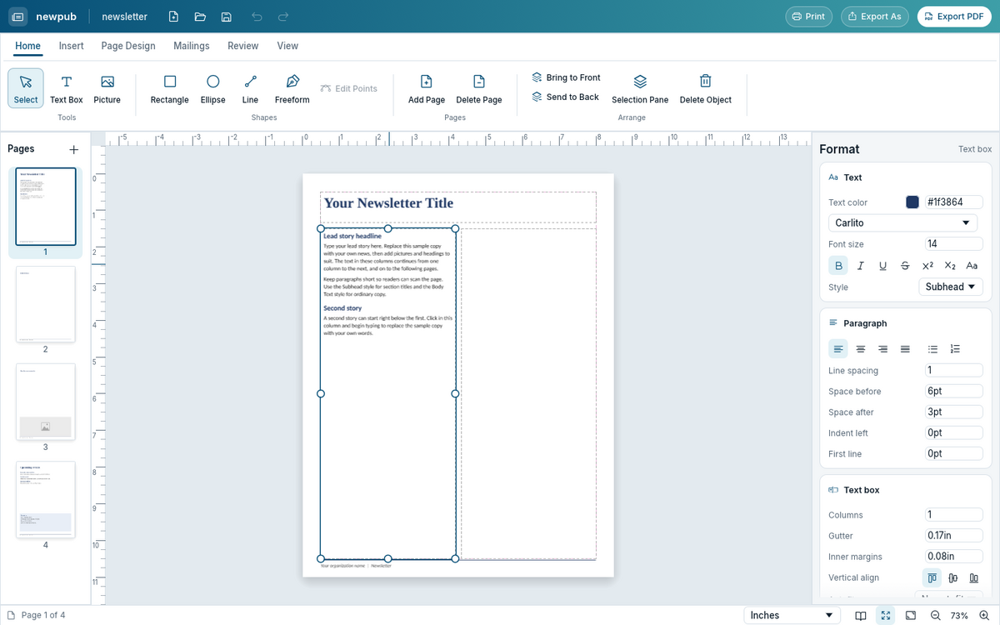
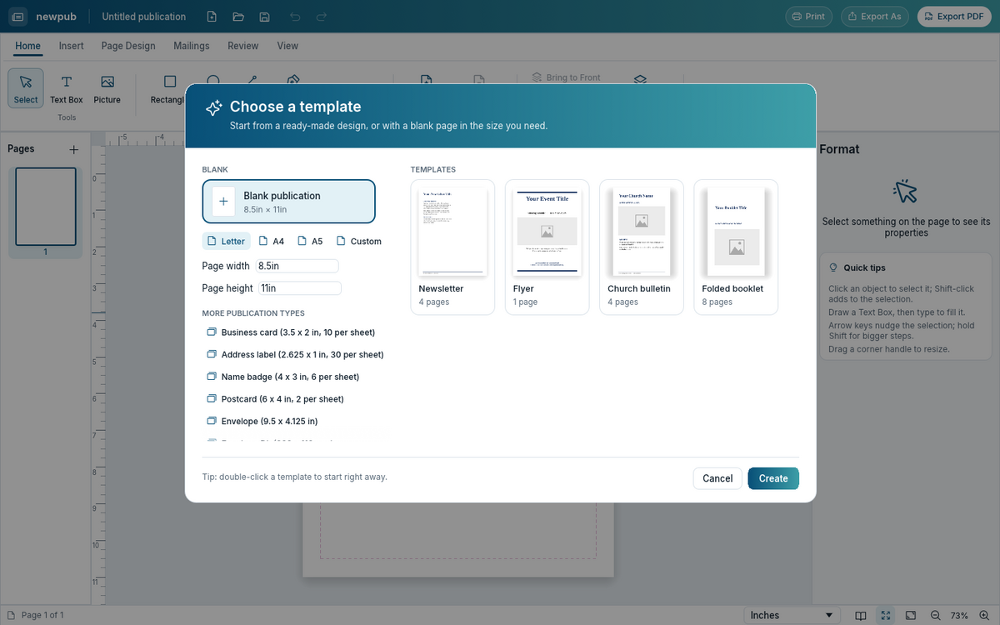
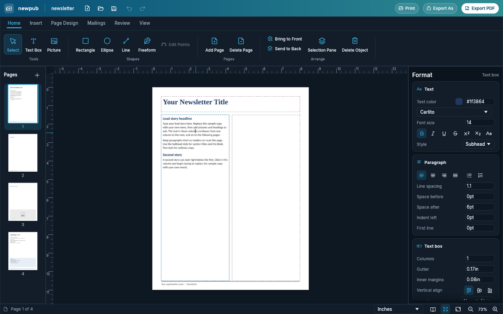
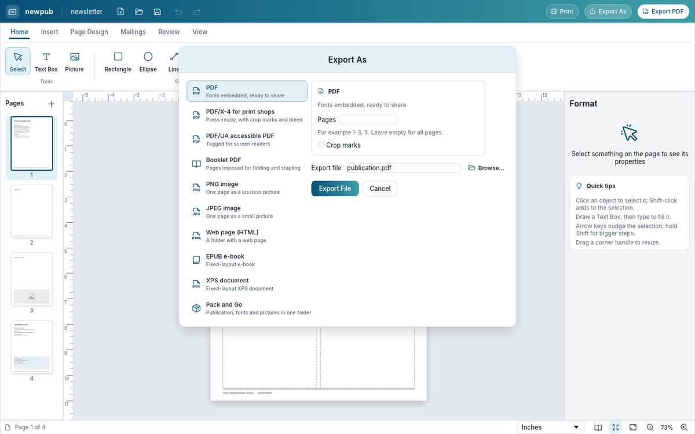

# newpub-rs

A desktop publishing app in Rust for macOS, Windows, and Linux, built toward feature parity with Microsoft Publisher.



| Start screen | Dark mode | Export As |
|---|---|---|
|  |  |  |

**To install it, see [INSTALL.md](INSTALL.md).** There is a setup program for Windows, a .dmg or .pkg for macOS, and an AppImage or .deb for Linux.

- `PARITY.md` lists the parity checklist and the journeys that prove each item.
- `ARCHITECTURE.md` covers crates, the document model, the command layer, layout, and testing.
- `PROGRESS.md` is the build log, with decisions and open blockers.
- `journeys/` holds the end-to-end journeys, which are the project's only tests.

```sh
cargo run -p newpub-app                          # the app
cargo run -p newpub-journeys --release           # run all journeys
cargo run -p newpub-journeys --release -- --filter J-TF   # a subset
python3 tools/dashboard/build.py                 # regenerate dashboard/index.html
```

Bundled fonts (Carlito, Liberation, DejaVu) are under open licences; see `assets/fonts/licenses`. The interface uses
Inter and Phosphor icons (OFL and MIT; see `assets/ui`).
